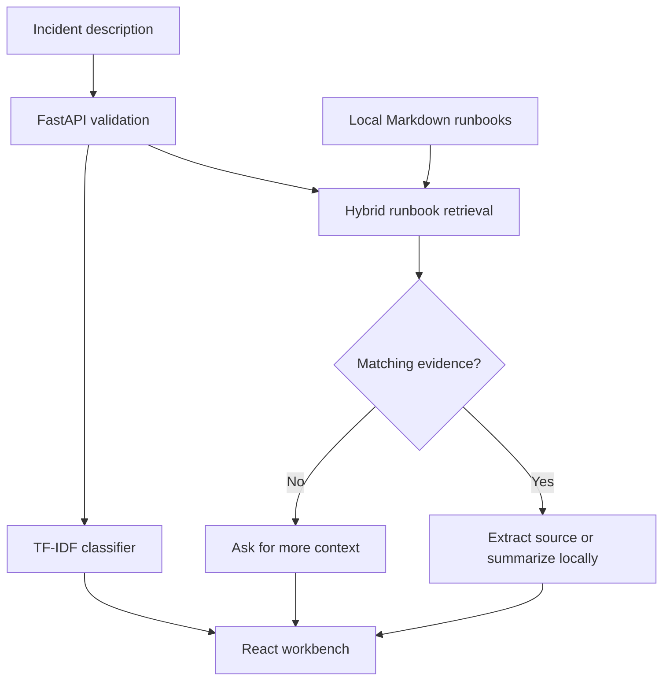

# RunbookOps

An incident-triage workbench that combines a trained text classifier with hybrid
runbook retrieval. Designed around a practical engineering question: **what should
I inspect next, and which document supports that recommendation?**

Independent portfolio project by Harsha Attili, developed with AI coding assistance.
All incidents and runbooks are original synthetic examples. This repository does
not contain employer code, internal documentation, or production performance claims.

## Scope

- Python API for classification, retrieval, and evidence-linked triage.
- A compact React/TypeScript workbench for investigating incidents.
- Reproducible evaluation with scenario-grouped classifier splits.
- Optional local-model synthesis; the default works without an LLM or API key.

## Run locally

Requires Python 3.12 and Node.js 24 (the versions targeted by CI).

```sh
python -m venv .venv
source .venv/bin/activate
# Windows PowerShell: .venv\Scripts\Activate.ps1
pip install -e '.[dev]'
python -m runbookops.evaluate
cd frontend
npm ci
npm run build
cd ..
python -m uvicorn runbookops.api:app --host 127.0.0.1 --port 8000
```

Open http://127.0.0.1:8000 for the workbench and http://127.0.0.1:8000/docs for
the API. For frontend development, run `npm run dev` in `frontend` with the API
running separately; Vite proxies `/api` to port 8000.

The editable install intentionally uses the checked-out `data/` and `reports/`
directories. For a non-editable package installation, set `RUNBOOKOPS_ROOT` to the
absolute checkout path. The Dockerfile sets this to `/app`.

## Try it

Choose **Connection pool**, inspect the routing signals, and open the referenced
source. Then choose **Outside the corpus** to inspect abstention. The **Evaluation**
tab displays measured results and misclassifications from the checked-in report.

```sh
curl http://127.0.0.1:8000/api/triage \
  -H 'Content-Type: application/json' \
  -d '{"query":"Kafka consumer lag keeps rising and the group rebalances repeatedly."}'
```

## How it fits together



The classifier uses TF-IDF and logistic regression. Retrieval combines BM25 and
TF-IDF cosine similarity. Sparse retrieval was chosen to make the first baseline
fast, reproducible, and easy to inspect. Neither LangChain nor a vector database
is required by this implementation.

## Evaluation and checks

```sh
python -m pytest -q
python -m runbookops.evaluate
```

The initial local run passed 15 tests and produced approximately **0.945 macro F1**
under three-fold, scenario-grouped cross-validation. The runbook retriever found
the expected document for 10 of 10 positive smoke cases and abstained on 4 of 4
unrelated smoke cases. This is a tiny synthetic benchmark, **not production accuracy**.

Read [the model card](docs/model-card.md) and inspect
[the complete evaluation](reports/evaluation.json), including failures and split
membership. The hosted CI workflow is configured but has not yet run on GitHub.

## Optional local LLM

Start an Ollama instance and choose a model already available on that instance.
Set `OLLAMA_MODEL` to that exact model name before starting the API. Optionally set
`OLLAMA_BASE_URL`; its default is `http://127.0.0.1:11434`. Check **Use configured
local LLM** in the UI. No model is downloaded automatically and no cloud service is
called by default.

Generation requires citation IDs from the retrieved evidence. Invalid IDs or a
provider failure return the original source extract. This validates references,
not factual entailment. The adapter has mocked contract tests; a live local-model
quality evaluation is still pending.

## Container

```sh
docker build -t runbookops .
docker run --rm -p 127.0.0.1:8000:8000 runbookops
```

The image builds the frontend and runs the API as a non-root user. Docker build
execution has not been verified in the current workspace. Keep this demo local:
authentication, rate limiting, and multi-tenant isolation are not implemented.

## Project notes

- [Design decisions](docs/decisions.md)
- [Data provenance](data/README.md)
- [Two-minute demo and interview discussion](docs/demo-script.md)
- [Next improvements](docs/roadmap.md)
- [Contribution workflow](CONTRIBUTING.md)

This project connects backend/API engineering, workflow troubleshooting, and
applied AI. AI assistance is documented; commit messages describe the actual
changes and timestamps are not backdated.

Implementation references: [scikit-learn pipelines](https://scikit-learn.org/stable/modules/compose.html),
[grouped splits](https://scikit-learn.org/stable/modules/generated/sklearn.model_selection.StratifiedGroupKFold.html),
[FastAPI static files](https://fastapi.tiangolo.com/tutorial/static-files/),
and [Ollama chat API](https://docs.ollama.com/api/chat).
