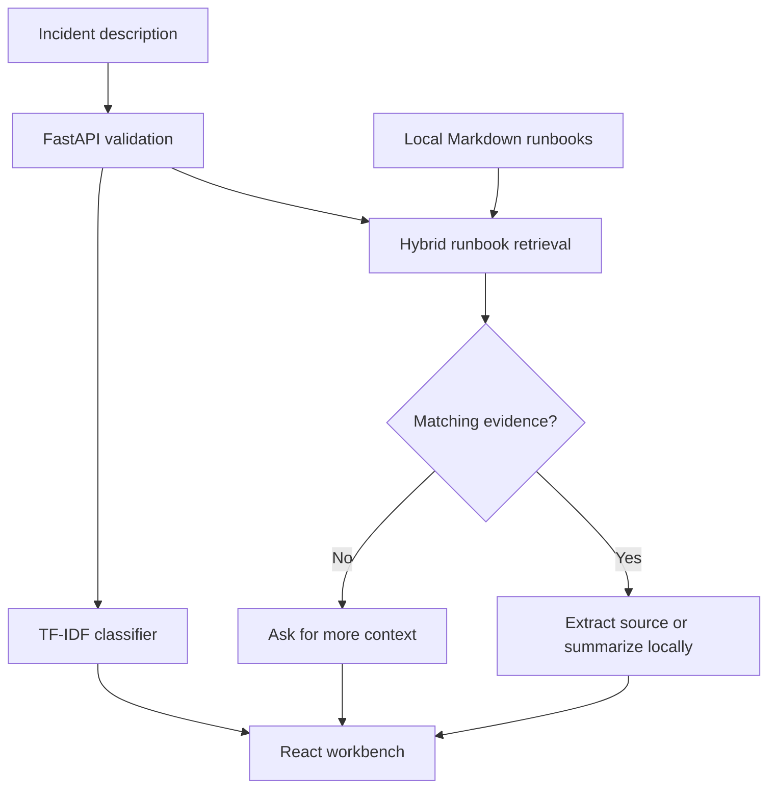

# RunbookOps

Route an incident description to a service area, retrieve relevant runbook passages,
and inspect the source lines behind each suggested investigation step.

RunbookOps is a local prototype built with Python, scikit-learn, FastAPI, and
React/TypeScript. Its default path uses a trained classifier and sparse retrieval;
local LLM synthesis is optional. The application never executes remediation.

**Status:** working baseline with passing Python tests and frontend build.
Evaluation uses 90 synthetic descriptions across 30 scenarios and 10 synthetic
runbooks, plus separate 20-query validation and holdout suites. Operational usefulness
has not been measured on real incidents.

For a code walkthrough, start with the [implementation map](docs/review-guide.md).
The [model card](docs/model-card.md) describes the evaluation protocol and its limits.

## Run locally

Requires Python 3.12 and Node.js 24 (the versions targeted by CI).

```sh
git clone https://github.com/harshaattili-human/runbookops.git
cd runbookops
python -m venv .venv
source .venv/bin/activate
# Windows PowerShell: .venv\Scripts\Activate.ps1
pip install -e '.[dev]'
python -m runbookops.evaluate
python -m runbookops.benchmark --split validation
cd frontend
npm ci
npm run build
cd ..
python -m uvicorn runbookops.api:app --host 127.0.0.1 --port 8000
```

Open http://127.0.0.1:8000 for the workbench and http://127.0.0.1:8000/docs for
the API. For frontend development, run `npm run dev` in `frontend` with the API
running separately; Vite proxies `/api` to port 8000.

The editable install intentionally uses the checked-out `data/` and `reports/`
directories. For a non-editable package installation, set `RUNBOOKOPS_ROOT` to the
absolute checkout path. The Dockerfile sets this to `/app`.

## Try it

Choose **Connection pool**, inspect the routing signals, and open the referenced
source. Then choose **Outside the corpus** to inspect abstention. The **Evaluation**
tab displays measured results and misclassifications from the checked-in report.

```sh
curl http://127.0.0.1:8000/api/triage \
  -H 'Content-Type: application/json' \
  -d '{"query":"Kafka consumer lag keeps rising and the group rebalances repeatedly."}'
```

## How it fits together



The classifier uses TF-IDF and logistic regression. Retrieval combines BM25 and
TF-IDF cosine similarity. Sparse retrieval was chosen to make the first baseline
fast, reproducible, and easy to inspect. Both indexes are built in memory from the
local Markdown files when the application starts.

## Evaluation and checks

```sh
python -m pytest -q
python -m runbookops.evaluate
python -m runbookops.benchmark --split validation
```

The classifier scores approximately **0.945 macro F1**, versus **0.067** for a
most-frequent-label baseline on the same three scenario-grouped folds. The original
retrieval smoke set found 10/10 expected documents and abstained on 4/4 unrelated
questions. The additional validation and holdout suites exposed a gap: each returned
guidance for **6/10 unsupported requests**, despite finding the expected top document
for all ten supported requests. These are small synthetic experiments.

Read [the baseline comparison and failure analysis](docs/evaluation-v1.md). Hybrid,
BM25 and TF-IDF rankings tied on these cases under the same eligibility gate. This
does not establish a hybrid advantage or production accuracy. Routine CI scores
validation; the documented holdout command is an explicit reproducibility step.

Read [the model card](docs/model-card.md) and inspect
[the complete evaluation](reports/evaluation.json), including failures and split
membership. [The first GitHub Actions run](https://github.com/harshaattili-human/runbookops/actions/runs/37152016110)
passed on October 3, 2026, including the Python tests, evaluation, and frontend
production build on Python 3.12 and Node.js 24.

## Optional local LLM

Start an Ollama instance and choose a model already available on that instance.
Set `OLLAMA_MODEL` to that exact model name before starting the API. Optionally set
`OLLAMA_BASE_URL`; its default is `http://127.0.0.1:11434`. Check **Use configured
local LLM** in the UI. No model is downloaded automatically and no cloud service is
called by default.

Generation requires citation IDs from the retrieved evidence. Invalid IDs or a
provider failure return the original source extract. This validates references,
not factual entailment. The adapter has mocked contract tests; a live local-model
quality evaluation is still pending.

## Container

```sh
docker build -t runbookops .
docker run --rm -p 127.0.0.1:8000:8000 runbookops
```

The image builds the frontend and runs the API as a non-root user. Docker build
execution has not been verified in the current workspace. Keep this demo local:
authentication, rate limiting, and multi-tenant isolation are not implemented.

## Project notes

- [Design decisions](docs/decisions.md)
- [Data provenance](data/README.md)
- [Two-minute demo and interview discussion](docs/demo-script.md)
- [Next improvements](docs/roadmap.md)
- [Contribution workflow](CONTRIBUTING.md)

## Provenance

Independent portfolio project by Harsha Attili, developed with AI coding assistance.
The code, incidents, and runbooks were created for this project; no employer code,
internal documents, or production logs are included. See [data provenance](data/README.md).

Implementation references: [scikit-learn pipelines](https://scikit-learn.org/stable/modules/compose.html),
[grouped splits](https://scikit-learn.org/stable/modules/generated/sklearn.model_selection.StratifiedGroupKFold.html),
[FastAPI static files](https://fastapi.tiangolo.com/tutorial/static-files/),
and [Ollama chat API](https://docs.ollama.com/api/chat).
